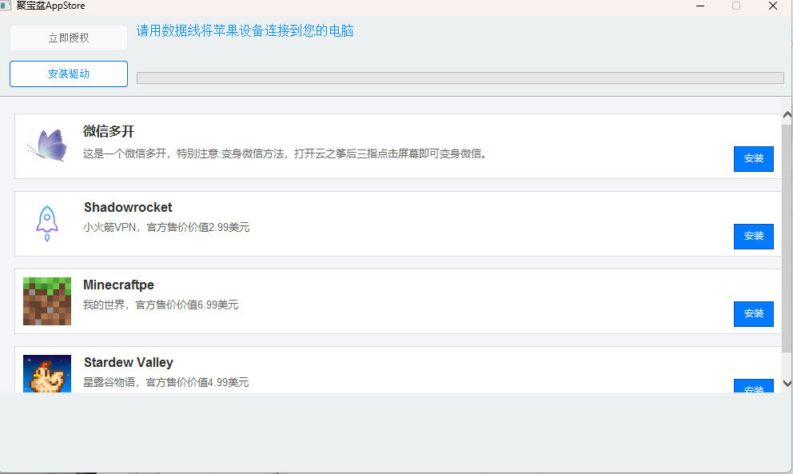
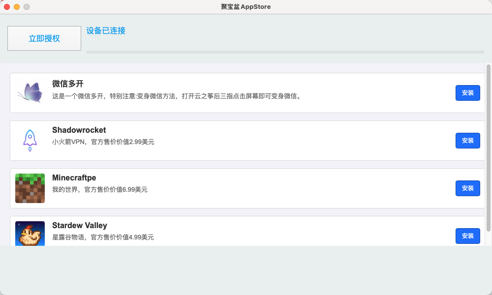

## 聚宝盆App Store 👋

聚宝盆AppStore是iOS 下免费的软件商城，使用聚宝盆客户端可以下载App Store 里面收费的 app。无需签名，永久有效。
window下使用
1.安装驱动。目前安装驱动功能尚未完成。请自行下载爱思助手进行驱动修复，或者下载 iTunes。
2.连接手机到电脑后，如果驱动正常。会提示设备已经连接。此时点击立即授权。等待设备授权完成即可
3.找到自己需要的 app 点击安装即可。

如果没有你想要的 app。可以提一个 issue。详细写清楚你想要的 app 信息。。我会尽快把这个 app 添加进去

目前此项目属于测试阶段。有什么 bug 请提 issue  我会尽快修复

